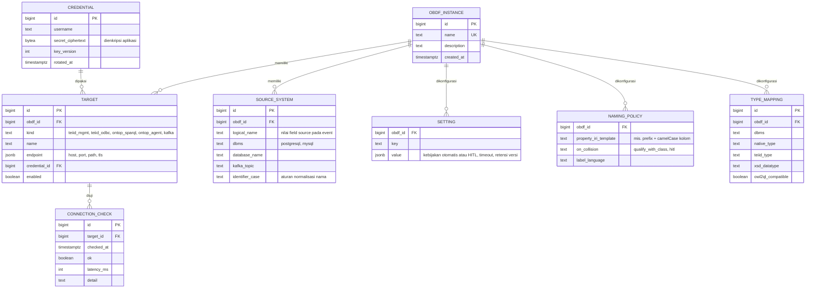
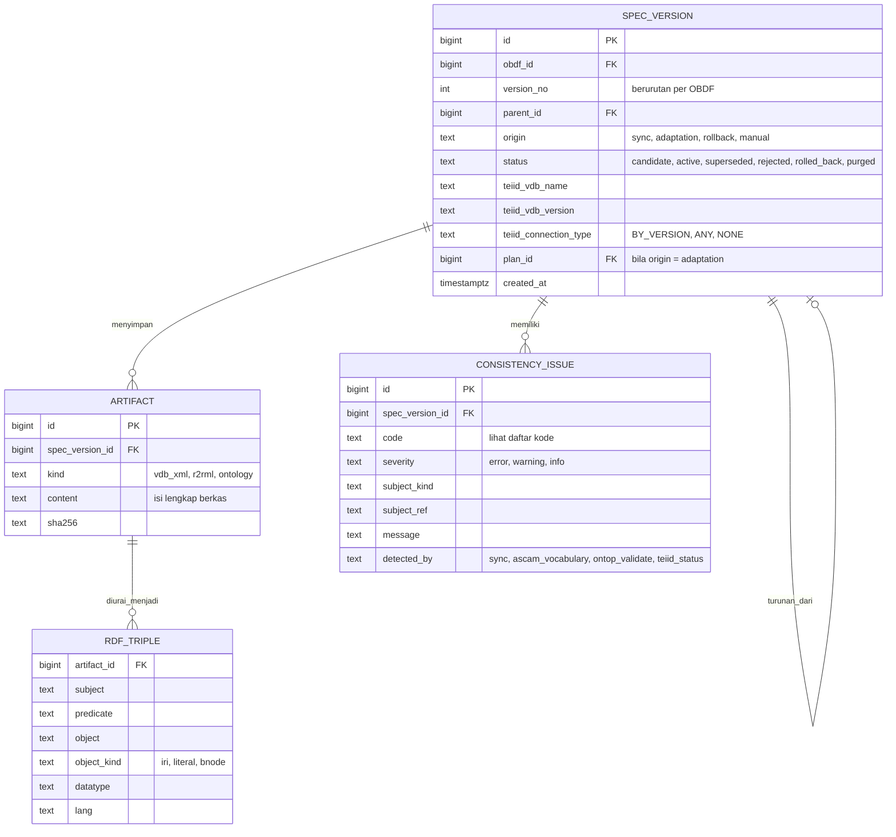
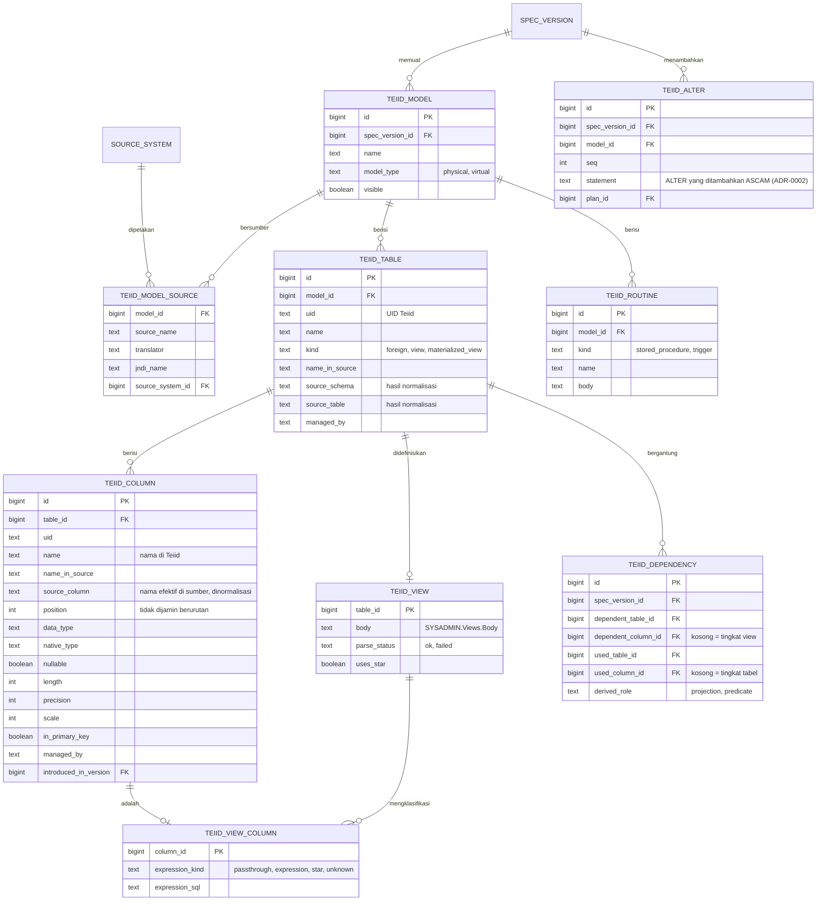
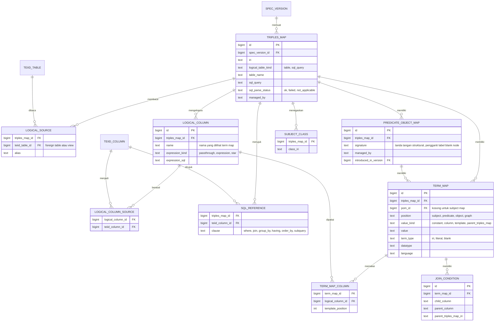
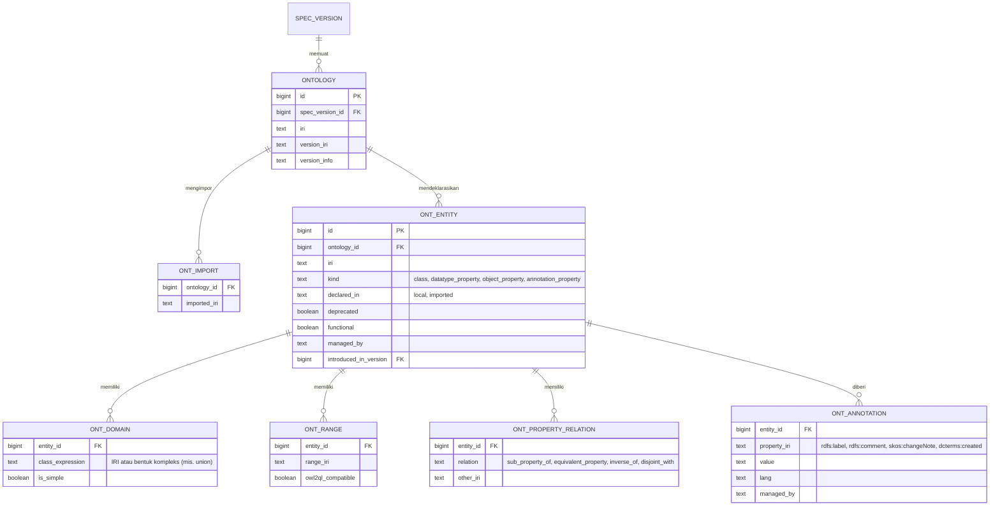
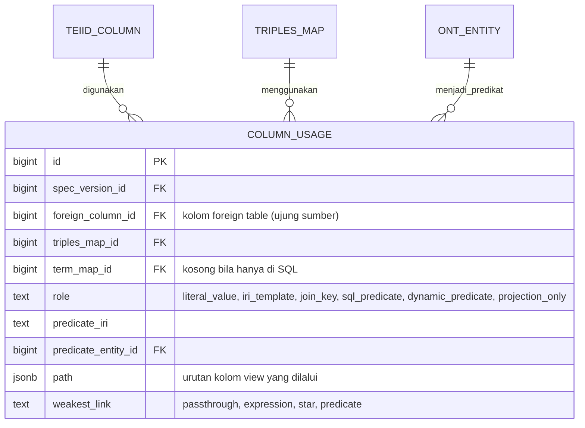
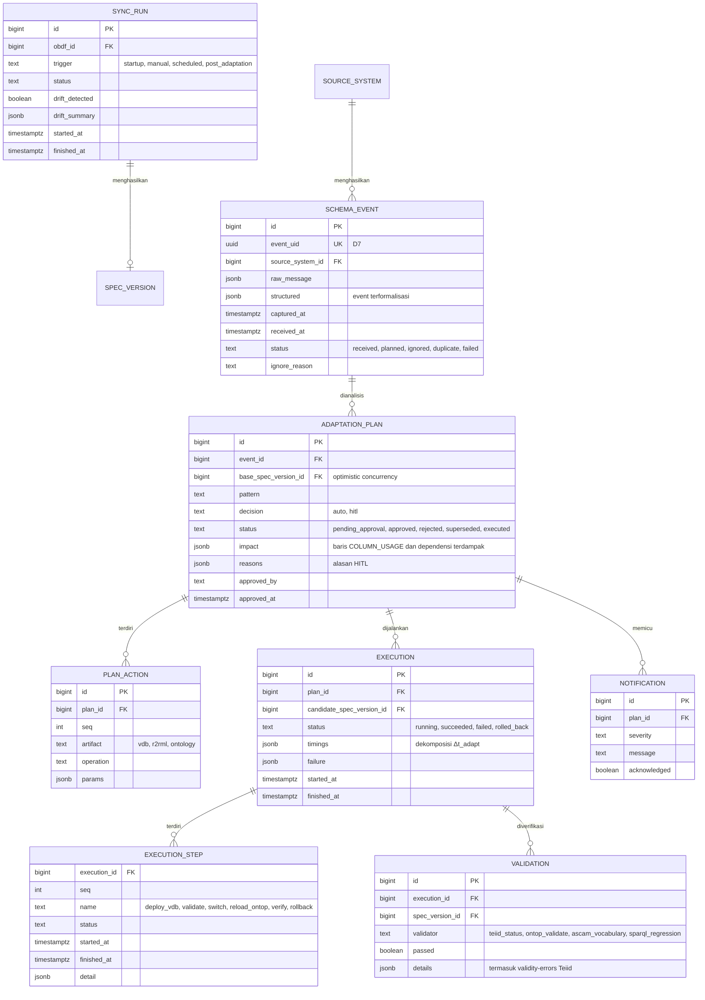

# Rancangan Komponen Knowledge ASCAM — versi 2

> Status: **disetujui (K1–K8)**; diimplementasikan pada F1.2 (ADR-0007). Model logis; tipe fisik,
> indeks, dan constraint ditetapkan pada migrasi (F1.2). Perubahan utama dari v1:
> dependensi view Teiid (ADR-0006), graf lineage ujung-ke-ujung, kepemilikan elemen,
> kebijakan (penamaan dan pemetaan tipe), masalah konsistensi, dan read model untuk UI.

## 1. Peran dan prinsip

Knowledge adalah **model runtime OBDF** (models@run.time; Blair dkk., 2009) yang dipakai
bersama oleh seluruh fase MAPE-K (Kephart & Chess, 2003).

| Prinsip | Wujud |
|---|---|
| **P1. Analyze dan Plan hanya membaca Knowledge** | Σ_S, ℳ, 𝒯, dan graf dependensinya tersedia tanpa menghubungi OBDF |
| **P2. Terhubung kausal** | Setiap sync dan adaptasi menghasilkan versi spesifikasi baru |
| **P3. Riwayat tidak diubah** | Versi, event, rencana, dan eksekusi bersifat append-only; hanya status yang berpindah. Baris versi tidak dihapus (tombstone); retensi menghapus isi versi dan menandainya `purged` |
| **P4. Generik** | Tidak ada nama objek studi kasus di skema; satu instalasi dapat mengelola beberapa OBDF |
| **P5. Merepresentasikan semua, mengadaptasi terbatas** | Semua pola pemakaian kolom dicatat; adaptasi otomatis hanya pada sel "otomatis" di §5 |
| **P6. Kepemilikan elemen** | Setiap elemen artefak ditandai `managed_by` (`human`/`ascam`) dan `introduced_in_version`. **ASCAM hanya menambah, dan hanya menghapus yang ia tambahkan sendiri** |
| **P7. Kredensial aman** | Rahasia dienkripsi di aplikasi; kunci di luar basis data (D4) |
| **P8. Satu pemilik basis data** | Hanya Knowledge Service yang mengakses PostgreSQL (D1) |

## 2. Graf dependensi

```text
kolom sumber ──(NameInSource)──▶ kolom foreign table ──(SYSADMIN.Usage)──▶ kolom view (bertingkat)
                                        │                                        │
                                        └──────────────┬─────────────────────────┘
                                                       ▼
                        logical column R2RML ──▶ term map ──▶ predikat ──▶ entitas 𝒯
```

Setiap tepi disimpan per versi spesifikasi. `spec.column_usage` adalah hasil penelusuran
graf yang dimaterialisasi saat sync, sehingga Orchestrator dan UI tidak perlu menelusuri
ulang untuk kasus umum.

## 3. Skema PostgreSQL

| Skema | Isi | Siklus hidup |
|---|---|---|
| `registry` | OBDF, target, kredensial, sumber, kebijakan (pengaturan, penamaan, pemetaan tipe), uji koneksi | Diubah administrator |
| `spec` | Versi spesifikasi, artefak, Σ_S, dependensi Teiid, ℳ, 𝒯, triple generik, lineage, masalah konsistensi | Immutable per versi |
| `ops` | Sync, event, rencana dan aksinya, eksekusi dan langkahnya, validasi, notifikasi, audit | Append-only |

**Versioning: snapshot per versi.** Setiap versi memiliki salinan lengkap baris Σ_S, ℳ,
dan 𝒯. Spesifikasi OBDF berukuran kecil, keadaan pada versi mana pun dapat dibaca langsung,
dan rollback cukup memindahkan penanda versi aktif, sejalan dengan versi VDB (ADR-0004).
Penyimpanan perubahan sebagai rekaman yang tidak diubah mengikuti gagasan event sourcing
(Fowler, 2005), dengan snapshot sebagai proyeksi siap baca.

## 4. Model logis

### 4.1 `registry`



### 4.2 `spec` — versi, artefak, triple, dan konsistensi



`RDF_TRIPLE` menyimpan ℳ dan 𝒯 sebagai triple (label blank node dikanonisasi per artefak)
agar diff semantik antarversi dapat dihitung di SQL dan ditampilkan di UI.

**Kode masalah konsistensi (awal):** `predicate_undeclared`, `predicate_kind_mismatch`,
`predicate_deprecated_in_use`, `logical_column_unresolved`, `teiid_column_missing`,
`sql_unparsed`, `view_body_unparsed`, `vdb_validity_error`, `owl2ql_profile_violation`,
`domain_conflict`, `name_collision`, `drift_detected`, `unused_property`.

### 4.3 `spec` — Σ_S dan dependensi Teiid

Sumber: `SYS.Schemas`, `SYS.Tables`, `SYS.Columns`, `SYS.KeyColumns` (ADR-0003),
`SYSADMIN.Usage`, `SYSADMIN.Views`, `SYSADMIN.MatViews`, `SYSADMIN.StoredProcedures`,
`SYSADMIN.Triggers` (ADR-0006), `get-vdb` (ADR-0004).



`derived_role = predicate` diberikan bila kolom dirujuk pada tingkat view tetapi tidak
menjadi sumber kolom view mana pun (terbukti untuk `WHERE` dan `JOIN` pada F0.7).

### 4.4 `spec` — ℳ (R2RML)

Sumber: `mapping.ttl` sebagai graf RDF (rdflib); `rr:sqlQuery` dianalisis dengan `sqlglot`
(proyeksi, alias, ekspresi, `WHERE`, `JOIN`, `GROUP BY`, subkueri, `UNION`, `*`).



### 4.5 `spec` — 𝒯 (ontologi)

Sumber: `ontology_file.ttl` sebagai graf RDF. Seluruh entitas dicatat untuk validasi
kosakata dan penelusuran; perubahan otomatis terbatas pada DatatypeProperty.



### 4.6 `spec` — lineage hasil penelusuran



`weakest_link` merangkum jenis tepi terlemah pada jalur (mis. satu tepi `expression` di view
membuat seluruh jalur tidak dapat disesuaikan otomatis saat DROP).

### 4.7 `ops` — jejak MAPE-K dan operasi



`ops.audit_log` (aktor, aksi, objek, waktu, rincian) mencatat setiap tindakan lewat UI,
termasuk persetujuan HITL; konsep entitas–aktivitas–agen sejalan dengan W3C PROV-O.

## 5. Matriks keputusan (D11 v2)

Diterapkan pada **setiap baris** jalur dampak kolom foreign table yang terdampak. Rencana
bersifat `auto` hanya bila semua baris bernilai otomatis.

| Kondisi | ADD | RENAME (D8) | DROP |
|---|---|---|---|
| Kolom tidak dipakai ℳ maupun view | Σ′_S (+P-001 bila kebijakan) | Σ′_S | Σ′_S |
| `literal_value`, jalur langsung atau hanya lewat `star` | P-001 untuk TriplesMap pada tabel atau view `SELECT *` | otomatis | P-002 (deprecate hanya bila pemakaian predikat terakhir) |
| `projection_only` | – | otomatis | otomatis (hapus dari proyeksi SQL) |
| `iri_template`, `join_key`, `sql_predicate`, `dynamic_predicate` | – | otomatis | **HITL** |
| Jalur melewati view dengan `expression` atau `predicate` | tidak merambat → notifikasi | otomatis | **HITL** (VDB akan FAILED, F0.7) |
| Kolom kunci primer | – | otomatis | **HITL** |
| Tabel pada model multi-source, materialized view, prosedur/trigger yang merujuk | **HITL** | **HITL** | **HITL** |
| Bentrok nama Teiid (ADR-0002) | nama alternatif | nama alternatif | – |
| ADD: IRI property sudah ada dengan domain kelas lain | kebijakan `qualify_with_class` atau HITL | – | – |
| Property sudah deprecated dan kolom muncul lagi | IRI baru sesuai kebijakan atau HITL | – | – |
| Entitas 𝒯 berasal dari `owl:imports`, atau penghapusan elemen `managed_by = human` diperlukan | **HITL** | **HITL** | **HITL** |
| SQL logical table atau `Body` view gagal di-parse | **HITL** | otomatis | **HITL** |
| Event duplikat / tabel tidak difederasikan / ALTER tidak didukung atau multi-aksi | diabaikan / diabaikan / HITL | idem | idem |
| Versi aktif berubah sejak rencana dibuat | rencana disusun ulang | idem | idem |

## 6. Kebutuhan pembaca

**Orchestrator** (Analyze dan Plan):

- `resolve_event(event)` → kolom foreign table (lewat `source_system`, `source_schema`,
  `source_table`, `source_column`) atau alasan diabaikan;
- `impact(foreign_column)` → baris `column_usage` beserta dependensi view dan routine,
  jumlah pemakaian tiap predikat, entitas 𝒯 terkait;
- kebijakan (`setting`, `naming_policy`, `type_mapping`), nomor versi berikutnya,
  pemeriksaan bentrok nama dan domain.

**Web UI** (read model sebagai view SQL, diakses lewat Knowledge API):

| Halaman | Sumber |
|---|---|
| Dasbor OBDF dan target | `registry.*`, `connection_check` terbaru, versi aktif, event terakhir |
| Linimasa versi dan diff | `spec_version`, `artifact` (diff teks), `rdf_triple` (diff triple), Σ_S antarversi |
| Lineage explorer | `teiid_dependency`, `column_usage`, `ont_entity` |
| Konsistensi | `consistency_issue` per versi |
| Antrean HITL | `adaptation_plan` berstatus `pending_approval`, beserta `impact` dan `reasons` |
| Eksekusi | `execution`, `execution_step`, `validation` (termasuk dekomposisi Δt) |
| Kebijakan | `setting`, `naming_policy`, `type_mapping` |
| Audit dan notifikasi | `ops.audit_log`, `notification` |

## 7. Pemetaan terhadap ERD proposal

| Proposal (Tabel 3.21–3.23) | Rancangan v2 | Alasan |
|---|---|---|
| `vdb`, `teiid_model`, `teiid_object`, `teiid_column`, dan duplikatnya di Tabel 3.22 no. 13–16 | `spec.spec_version` (nama/versi VDB), `teiid_model`, `teiid_table`, `teiid_column` | Satu sumber kebenaran |
| `source_database`, `source_table`, `source_column`, `object_mapping`, `column_mapping` | `registry.source_system`, `teiid_model_source`, kolom `source_*` pada `teiid_table`/`teiid_column` | ASCAM tidak membaca skema sumber; pemetaan lewat `NameInSource` |
| `view_definition`, `object_dependency`, `column_dependency` | `teiid_view`, `teiid_view_column`, `teiid_dependency` | Diisi dari `SYSADMIN.Views` dan `SYSADMIN.Usage` (ADR-0006) |
| `foreign_key` | Ditunda | Belum dipakai analisis dampak |
| `R2RML_MAPPING` | `artifact` (kind = r2rml) + `rdf_triple` | Isi dan triple per versi |
| `TRIPLES_MAP`, `LOGICAL_TABLE` | `triples_map`, `logical_source` | Logical table bisa membaca beberapa tabel/view |
| `SUBJECT_MAP`, `PREDICATE_MAP`, `OBJECT_MAP`, `TERM_MAP` | `term_map` (`position`) | Satu tabel generik |
| `PREDICATE_OBJECT_MAP`, `REF_OBJECT_MAP`, `JOIN_CONDITION`, `CLASS_ASSERTION` | `predicate_object_map`, `term_map`, `join_condition`, `subject_class` | Setara, ditambah tanda tangan struktural |
| `LOGICAL_COLUMN`, `TERM_COLUMN_REFFERENCE`, `SQL_COLUMN_DEPENDENCY` | `logical_column`, `logical_column_source`, `term_map_column`, `sql_reference`, dan hasil `column_usage` | Dipisah per jenis tepi agar penelusuran eksplisit |
| `Ontology`, `Ontology_version` | `ontology`, `spec_version` | Versi mengikuti versi spesifikasi |
| `Ontology_resource`, `Owl_property` | `ont_entity` | Satu registri entitas |
| `Owl_property_domain`, `Owl_property_range`, `Owl_property_hierarchy`, `Owl_property_characteristic` | `ont_domain`, `ont_range`, `ont_property_relation`, `ont_entity.functional` | Setara; domain kompleks dan kompatibilitas OWL 2 QL dicatat |
| `Owl_datatype_restriction` | Ditunda | Belum dipakai pola adaptasi |
| (belum ada) | `registry.*`, `ont_import`, `ont_annotation`, `teiid_routine`, `teiid_alter`, `rdf_triple`, `consistency_issue`, `ops.*` | Konfigurasi, kepemilikan, versioning, konsistensi, dan jejak MAPE-K |

## 8. Implementasi

- Kode: `setup/ascam/knowledge/` (lihat README di folder tersebut). Keputusan implementasi
  dan buktinya: ADR-0007.
- Migrasi: SQLAlchemy 2 + Alembic. Driver: psycopg 3 (ADR-0003).
- Integritas P2/P3 ditegakkan dengan foreign key komposit dan trigger di basis data.
- Knowledge Service (FastAPI) sebagai satu-satunya pengakses basis data (F1.3); role
  `ascam_owner` (migrasi) dan `ascam_app` (DML).
- Sync diuji terhadap OBDF studi kasus dan dibandingkan dengan hasil F0.3, F0.5, dan F0.7 (F1.4).

## Referensi

- Blair, G., Bencomo, N., France, R. B. (2009). Models@run.time. *Computer*, 42(10), 22–27. https://doi.org/10.1109/MC.2009.326
- Kephart, J. O., Chess, D. M. (2003). The Vision of Autonomic Computing. *Computer*, 36(1), 41–50. https://doi.org/10.1109/MC.2003.1160055
- Fowler, M. (2005). Event Sourcing. https://martinfowler.com/eaaDev/EventSourcing.html
- W3C (2012). R2RML: RDB to RDF Mapping Language. https://www.w3.org/TR/r2rml/
- W3C (2012). OWL 2 Web Ontology Language Profiles. https://www.w3.org/TR/owl2-profiles/
- W3C (2013). PROV-O: The PROV Ontology. https://www.w3.org/TR/prov-o/
- Teiid Reference Guide (`teiid-documents.pdf`): "System schema" dan "SYSADMIN schema" (hlm. 554–569).
- Proposal tesis, Sub-bab 3.6 (hlm. 81–92), Tabel 3.21–3.23.
- ADR-0001 s.d. ADR-0006 (`docs/adr/`).
