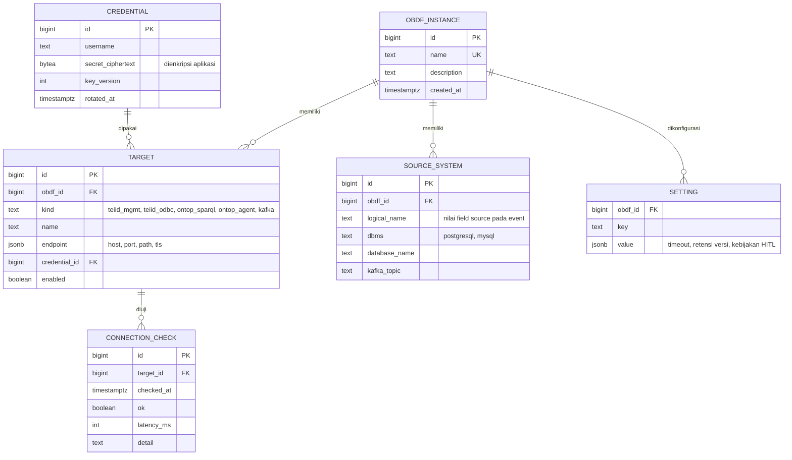
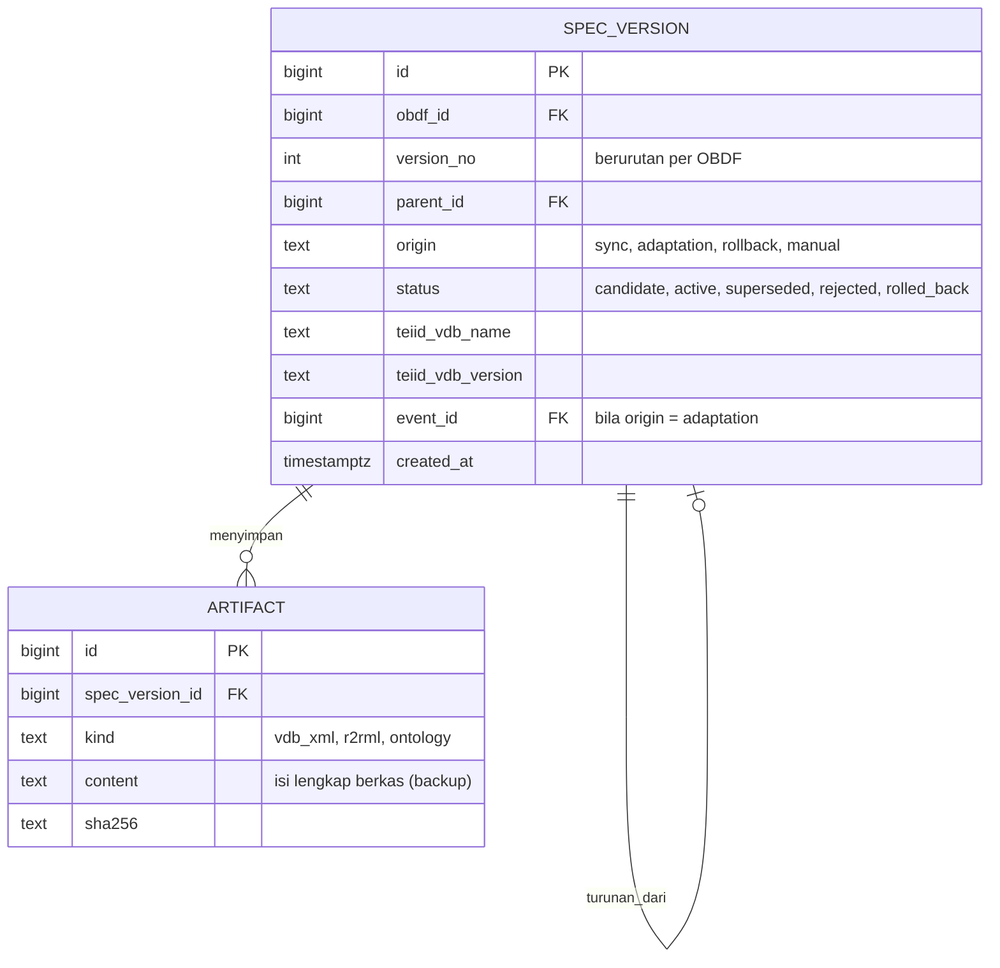
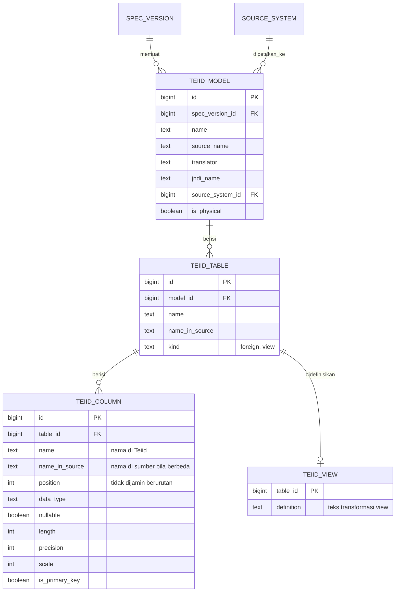
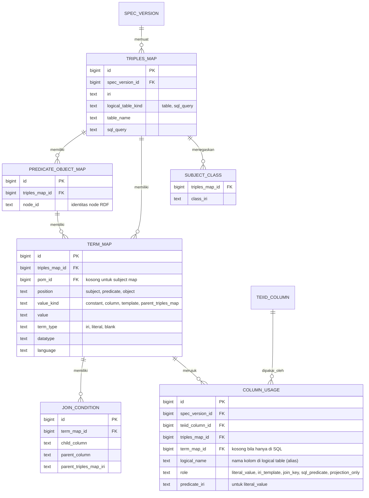
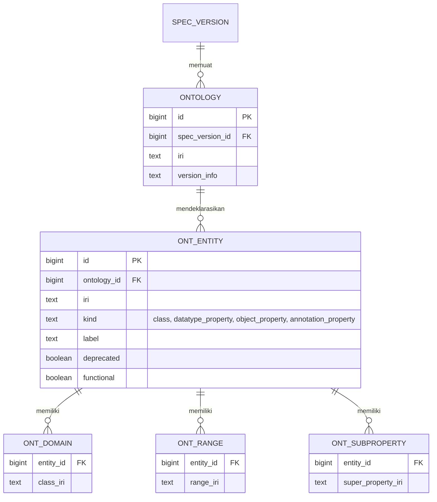
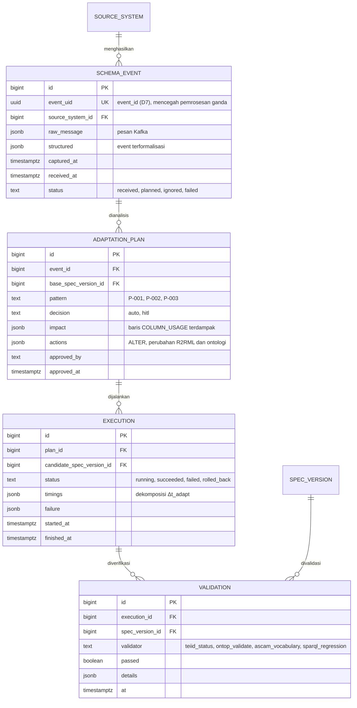

# Rancangan Komponen Knowledge ASCAM (F1)

> Status: **draf untuk ditinjau**. Tabel dan kolom di bawah adalah model logis; tipe
> fisik dan indeks ditetapkan saat implementasi migrasi (F1.2).

## 1. Peran dan prinsip

Knowledge adalah **model runtime OBDF** (models@run.time): representasi diri sistem yang
terhubung secara kausal dengan sistem tersebut (Blair, Bencomo & France, 2009). Pada
MAPE-K, Knowledge dipakai bersama oleh seluruh fase (Kephart & Chess, 2003). Konsekuensinya
bagi ASCAM:

| Prinsip | Wujud dalam rancangan |
|---|---|
| **P1. Analyze dan Plan hanya membaca Knowledge** | Seluruh Σ_S, ℳ, 𝒯, dan keterkaitannya tersedia tanpa menghubungi OBDF |
| **P2. Terhubung kausal** | Setiap adaptasi dan sync menghasilkan versi spesifikasi baru |
| **P3. Riwayat tidak diubah (append-only)** | Versi spesifikasi, event, rencana, dan eksekusi tidak pernah di-`UPDATE` isinya; hanya status yang berpindah |
| **P4. Generik** | Tidak ada nama tabel/kolom/kelas studi kasus di skema; satu instalasi dapat mengelola lebih dari satu OBDF |
| **P5. Batasan penelitian eksplisit** | Adaptasi otomatis hanya untuk kolom yang menjadi nilai DatatypeProperty. Peran lain (template IRI, join, filter, view) tetap **dicatat** agar dapat dideteksi dan dieskalasi (D11) |
| **P6. Kredensial aman** | Rahasia dienkripsi di aplikasi, kunci berada di luar basis data (D4) |
| **P7. Satu pemilik** | Hanya Knowledge Service yang mengakses PostgreSQL (D1) |

## 2. Pembagian skema PostgreSQL

| Skema | Isi | Siklus hidup |
|---|---|---|
| `registry` | OBDF yang dikelola, target (Teiid, Ontop Agent, Kafka), kredensial, sumber data, pengaturan ASCAM, hasil uji koneksi | Dapat diubah administrator |
| `spec` | **Versi spesifikasi OBDF** beserta isi artefak dan model ternormalisasi Σ_S, ℳ, 𝒯, serta lineage kolom | Immutable per versi |
| `ops` | Jejak MAPE-K: event skema, rencana adaptasi, eksekusi, validasi, audit | Append-only |

### Strategi versioning: snapshot per versi

Setiap versi spesifikasi (`spec.spec_version`) memiliki **salinan lengkap** baris Σ_S, ℳ,
dan 𝒯-nya sendiri, bukan sekadar selisih. Alasan:

- spesifikasi OBDF berukuran kecil (puluhan–ratusan baris per versi), sehingga biaya
  penyimpanan tidak signifikan;
- kueri "keadaan pada versi N" dan perbandingan dua versi menjadi sederhana dan tidak
  memerlukan rekonstruksi riwayat;
- rollback cukup memindahkan penanda versi aktif, sejalan dengan versi VDB (ADR-0004).

Pola ini mengikuti gagasan penyimpanan perubahan sebagai rekaman yang tidak diubah
(event sourcing; Fowler, 2005), dengan snapshot sebagai proyeksi yang siap dibaca.

## 3. Model logis

### 3.1 `registry` — konfigurasi dan target

### 3.2 `spec` — versi dan artefak

### 3.3 `spec` — Σ_S (Teiid)

Sumber data: tabel `SYS` Teiid (ADR-0003). Nama efektif di sumber = `name_in_source`
bila terisi, selain itu `name` (ADR-0002).

### 3.4 `spec` — ℳ (R2RML) dan lineage kolom

Sumber data: `mapping.ttl` dibaca sebagai graf RDF (rdflib); `rr:sqlQuery` dianalisis
dengan `sqlglot` untuk mendapatkan kolom yang diproyeksikan, di-alias, dan dipakai di
`WHERE`/`JOIN`.

`COLUMN_USAGE` adalah **inti analisis dampak**: satu baris per penggunaan kolom Teiid di
ℳ. Tabel ini menggantikan `LOGICAL_COLUMN`, `TERM_COLUMN_REFFERENCE`,
`SQL_COLUMN_DEPENDENCY`, dan `column_mapping` pada proposal. Nilai `role` menentukan sel
matriks D11:

| `role` | ADD | RENAME | DROP |
|---|---|---|---|
| `literal_value` | – | otomatis (D8) | otomatis (P-002) |
| `iri_template` | – | otomatis (D8) | HITL |
| `join_key` | – | otomatis (D8) | HITL |
| `sql_predicate` | – | otomatis (D8) | HITL |
| `projection_only` | – | otomatis (D8) | otomatis |
| kolom tanpa baris `COLUMN_USAGE` | Σ′_S (+ P-001 bila kebijakan menambah property) | Σ′_S | Σ′_S |
| tabel dirujuk `TEIID_VIEW` | – | otomatis (D8) | HITL (konservatif) |

### 3.5 `spec` — 𝒯 (ontologi)

Sumber data: `ontology_file.ttl` dibaca sebagai graf RDF. Seluruh entitas dicatat agar
validator kosakata (ADR-0005) dapat memeriksa predikat ℳ′; perubahan otomatis tetap
terbatas pada DatatypeProperty.

### 3.6 `ops` — jejak MAPE-K

Tabel `ops.audit_log` (aktor, aksi, objek, waktu, rincian) mencatat setiap tindakan
administrator lewat UI, termasuk persetujuan HITL. Konsep entitas–aktivitas–agen pada
jejak ini sejalan dengan W3C PROV-O.

## 4. Pemetaan terhadap ERD proposal

| Proposal | Rancangan revisi | Alasan |
|---|---|---|
| `vdb`, `teiid_model`, `teiid_object`, `teiid_column` (Tabel 3.21) dan duplikatnya di Tabel 3.22 (no. 13–16) | `spec.teiid_model`, `spec.teiid_table`, `spec.teiid_column`; nama/versi VDB di `spec.spec_version` | Satu sumber kebenaran; versi VDB menjadi bagian versi spesifikasi |
| `source_database`, `source_table`, `source_column`, `object_mapping`, `column_mapping` | `registry.source_system` + `teiid_*.name_in_source` | ASCAM tidak membaca skema sumber secara langsung (ego sektoral); pemetaan sumber↔Teiid diwakili `NameInSource` (ADR-0002, ADR-0003) |
| `view_definition`, `object_dependency`, `column_dependency` | `spec.teiid_view` + aturan konservatif D11 | Dependensi kolom pada view tidak tersedia di tabel `SYS`; dieskalasi ke HITL |
| `foreign_key` | Ditunda | Belum dipakai analisis dampak pada batasan penelitian |
| `R2RML_MAPPING` | `spec.artifact` (kind = r2rml) | Isi berkas disimpan per versi |
| `TRIPLES_MAP`, `LOGICAL_TABLE` | `spec.triples_map` | Logical table melekat 1:1 pada triples map |
| `SUBJECT_MAP`, `PREDICATE_MAP`, `OBJECT_MAP`, `TERM_MAP` | `spec.term_map` (kolom `position`) | Satu tabel term map generik |
| `PREDICATE_OBJECT_MAP`, `REF_OBJECT_MAP`, `JOIN_CONDITION`, `CLASS_ASSERTION` | `spec.predicate_object_map`, `spec.term_map` (`value_kind` = parent_triples_map), `spec.join_condition`, `spec.subject_class` | Setara |
| `LOGICAL_COLUMN`, `TERM_COLUMN_REFFERENCE`, `SQL_COLUMN_DEPENDENCY` | `spec.column_usage` | Satu tabel lineage dengan `role` |
| `Ontology`, `Ontology_version` | `spec.ontology` + `spec.spec_version` | Versi ontologi mengikuti versi spesifikasi |
| `Ontology_resource`, `Owl_property` | `spec.ont_entity` | Satu registri entitas |
| `Owl_property_domain`, `Owl_property_range`, `Owl_property_hierarchy` | `spec.ont_domain`, `spec.ont_range`, `spec.ont_subproperty` | Setara |
| `Owl_property_characteristic` | `spec.ont_entity.functional` | Hanya karakteristik yang relevan bagi DatatypeProperty |
| `Owl_datatype_restriction` | Ditunda | Belum dipakai pola adaptasi |
| (belum ada) | `registry.*`, `ops.*` | Konfigurasi, kredensial, dan jejak MAPE-K |

## 5. Implementasi (F1.2 dan seterusnya)

- **Migrasi skema:** SQLAlchemy 2 + Alembic (riwayat migrasi terversi).
- **Driver:** psycopg 3 (ADR-0003).
- **Layanan:** Knowledge Service (FastAPI) sebagai satu-satunya pemilik basis data (D1),
  dengan role basis data terpisah per layanan (D4).
- **Pengujian:** skema diuji dengan PostgreSQL sementara; sync pertama diuji terhadap
  spesifikasi OBDF studi kasus dan dibandingkan dengan hasil F0.3 dan F0.5.

## Referensi

- Blair, G., Bencomo, N., France, R. B. (2009). Models@run.time. *Computer*, 42(10), 22–27. https://doi.org/10.1109/MC.2009.326
- Kephart, J. O., Chess, D. M. (2003). The Vision of Autonomic Computing. *Computer*, 36(1), 41–50. https://doi.org/10.1109/MC.2003.1160055
- Fowler, M. (2005). Event Sourcing. https://martinfowler.com/eaaDev/EventSourcing.html
- W3C (2013). PROV-O: The PROV Ontology. https://www.w3.org/TR/prov-o/
- W3C (2012). R2RML: RDB to RDF Mapping Language. https://www.w3.org/TR/r2rml/
- Proposal tesis, Sub-bab 3.6 (hlm. 81–92), Tabel 3.21–3.23.
- ADR-0002 s.d. ADR-0005 (`docs/adr/`).
